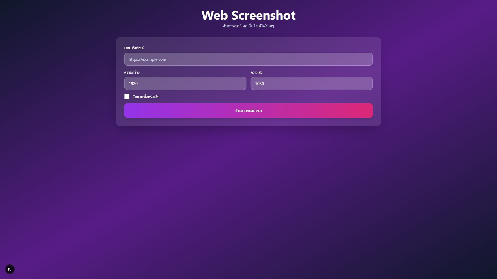

# Web Screenshot Tool

เว็บแอปพลิเคชันสำหรับจับภาพหน้าจอเว็บไซต์ได้ง่ายๆ ด้วย Next.js และ Puppeteer

## ตัวอย่างการใช้งาน



## คุณสมบัติ

- 📸 จับภาพหน้าจอเว็บไซต์ได้ง่ายๆ
- 📱 ออกแบบตามหลัก Mobile First
- 🎨 UI สวยงามด้วย Tailwind CSS
- 📏 สามารถกำหนดความกว้างและความสูงได้
- 📄 รองรับการจับภาพทั้งหน้าเว็บ (Full Page)
- 💾 ดาวน์โหลดภาพได้ทันที
- 🚀 ใช้งานง่าย

## เทคโนโลยีที่ใช้

- **Next.js 16** - Framework สำหรับ React
- **TypeScript 6** - ภาษาโปรแกรมที่ปลอดภัย
- **Tailwind CSS 4** - CSS Framework สำหรับการออกแบบ UI (ใช้ `@import "tailwindcss";`)
- **Puppeteer** - Library สำหรับควบคุม Chrome/Chromium

## วิธีการติดตั้ง

1. Clone หรือดาวน์โหลดโครงการนี้
2. ติดตั้ง dependencies:

```bash
npm install
```

## วิธีการใช้งาน

### รันโหมดพัฒนา (Development)

```bash
npm run dev
```

จากนั้นเปิดเบราว์เซอร์ไปที่ [http://localhost:3000](http://localhost:3000)

### สร้างไฟล์สำหรับ Production

```bash
npm run build
```

### รันโหมด Production

```bash
npm start
```

## วิธีการใช้งานบนเว็บ

1. เปิดเว็บแอปพลิเคชัน
2. ใส่ URL ของเว็บไซต์ที่ต้องการจับภาพ (เช่น `https://google.com`)
3. (可选) กำหนดความกว้างและความสูงของภาพ
4. (可选) ติ๊กเลือก "จับภาพทั้งหน้าเว็บ" ถ้าต้องการจับภาพทั้งหน้า
5. คลิกปุ่ม **"จับภาพหน้าจอ"**
6. รอสักครู่จนกว่าภาพจะปรากฏขึ้น
7. คลิกปุ่ม **"ดาวน์โหลด"** เพื่อบันทึกภาพ

## โครงสร้างโครงการ

```
Web-Screenshot/
├── app/
│   ├── api/
│   │   └── screenshot/
│   │       └── route.ts    # API สำหรับจับภาพหน้าจอ
│   ├── globals.css         # Styles ทั่วไป
│   ├── layout.tsx          # Layout หลัก
│   └── page.tsx            # หน้าแรก
├── package.json
├── tailwind.config.ts
├── tsconfig.json
└── README.md
```

## การทำงาน

1. ผู้ใช้กรอก URL และตั้งค่าต่างๆ บนหน้าเว็บ
2. แอปพลิเคชันส่งคำขอไปที่ API `/api/screenshot`
3. API ใช้ Puppeteer เปิดเบราว์เซอร์และไปยัง URL ที่ระบุ
4. Puppeteer จับภาพหน้าจอและส่งกลับเป็น base64
5. แอปพลิเคชันแสดงผลภาพและให้ดาวน์โหลดได้

## ความต้องการระบบ

- Node.js 18 ขึ้นไป
- npm หรือ yarn

## ใช้งานผ่าน API

คุณสามารถใช้งาน API จาก Vercel ได้โดยตรง

### Endpoint
```
POST https://web-screenshot-six.vercel.app/api/screenshot
```

### Request Body
```json
{
  "url": "https://example.com",
  "width": 1920,
  "height": 1080,
  "fullPage": false
}
```

### Response
```json
{
  "imageUrl": "data:image/png;base64,..."
}
```

### ตัวอย่างการใช้งานด้วย curl
```bash
curl -X POST https://web-screenshot-six.vercel.app/api/screenshot \
  -H "Content-Type: application/json" \
  -d '{"url": "https://google.com", "width": 1280, "height": 720}'
```

## ใช้งานด้วย Local Script

คุณสามารถใช้ local script เพื่อเรียก API และบันทึกภาพลงเครื่องได้เลย

### ติดตั้ง dependencies
```bash
npm install
```

### วิธีการใช้งาน
```bash
# รูปแบบทั่วไป
npm run screenshot <url> [width] [height] [fullPage] [outputPath]

# ตัวอย่าง
npm run screenshot https://google.com
npm run screenshot https://google.com 1280 720 true my-google.png

# หรือใช้ node โดยตรง
node fetch-screenshot.cjs https://example.com
```

### Parameters
- `url`: URL ของเว็บไซต์ที่ต้องการจับภาพ (จำเป็น)
- `width`: ความกว้างของภาพ (ค่าเริ่มต้น: 1920)
- `height`: ความสูงของภาพ (ค่าเริ่มต้น: 1080)
- `fullPage`: จับภาพทั้งหน้าเว็บหรือไม่ (true/false, ค่าเริ่มต้น: false)
- `outputPath`: ที่อยู่ไฟล์สำหรับบันทึกภาพ (ค่าเริ่มต้น: ./screenshot.png)

### ใช้เป็น Module ในโค้ดของคุณ
```javascript
const takeScreenshot = require('./fetch-screenshot.cjs');

async function myFunction() {
  await takeScreenshot('https://example.com', {
    width: 1280,
    height: 720,
    fullPage: false,
    outputPath: './my-screenshot.png'
  });
}
```

## หมายเหตุ

- ใช้บริการ screenshot ออนไลน์ฟรีเพื่อทำงานร่วมกับ Vercel ได้ดีขึ้น
- การจับภาพอาจใช้เวลาสักครู่ ขึ้นอยู่กับความเร็วของอินเทอร์เน็ตและขนาดของเว็บไซต์

## License

MIT
